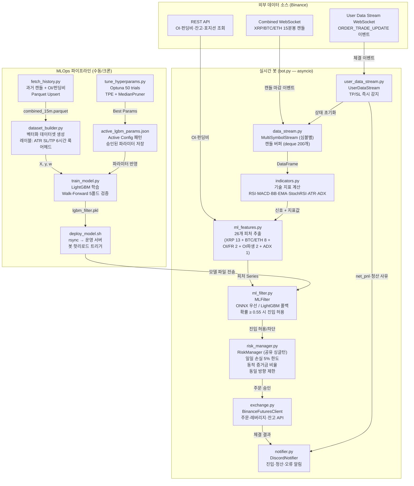
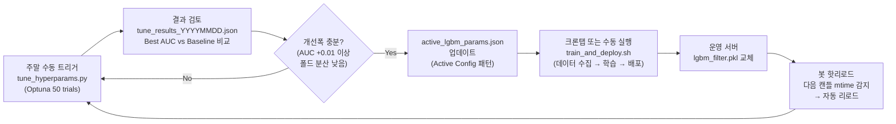
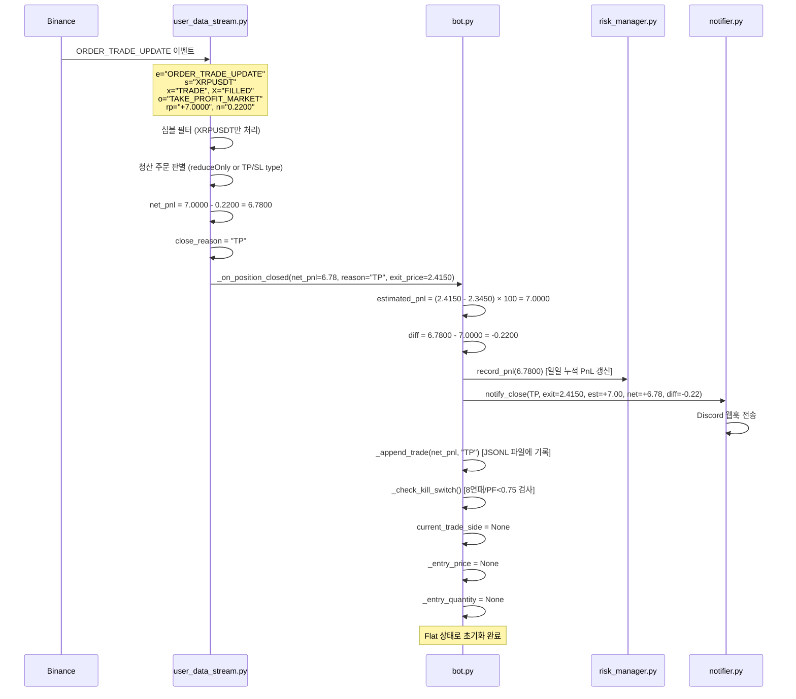

# CoinTrader — 아키텍처 문서

> 이 문서는 CoinTrader의 내부 구조를 설명합니다.
> **봇 사용법**은 [README.md](README.md)를 참고하세요.

---

## 목차

1. [시스템 개요](#1-시스템-개요) — 봇이 무엇을 하는지, 어떤 구조인지
2. [매매 판단 과정](#2-매매-판단-과정) — 15분마다 어떤 과정을 거쳐 매매하는지
3. [5개 레이어 상세](#3-5개-레이어-상세) — 각 레이어의 역할과 동작 원리
4. [MLOps 파이프라인](#4-mlops-파이프라인) — ML 모델의 학습·배포·모니터링 전체 흐름
5. [핵심 동작 시나리오](#5-핵심-동작-시나리오) — 실제 상황별 봇의 동작 흐름도
5-1. [MTF Pullback Bot](#5-1-mtf-pullback-bot) — 멀티타임프레임 풀백 전략 Dry-run 봇
6. [테스트 커버리지](#6-테스트-커버리지) — 무엇을 어떻게 테스트하는지
7. [파일 구조](#7-파일-구조) — 전체 파일 역할 요약

---

## 1. 시스템 개요

CoinTrader는 **Binance Futures 자동매매 봇**입니다.

**한 줄 요약**: 15분마다 기술 지표로 매매 신호를 생성하고, ML 모델로 한 번 더 검증한 뒤, 조건을 충족하면 자동으로 주문을 넣습니다.

### 1.1 전체 흐름 (간략)

```
15분봉 마감 → 기술 지표 계산 → 매매 신호 생성 → ML 필터 검증 → 리스크 체크 → 주문 실행 → Discord 알림
```

### 1.2 멀티심볼 아키텍처

여러 심볼을 동시에 거래합니다. 각 심볼은 독립된 봇 인스턴스로 실행되며, 리스크 관리만 공유합니다.

```
main.py
  └─ Config (SYMBOLS=XRPUSDT)  # 멀티심볼 지원, 현재 XRP만 운영
  └─ RiskManager (공유 싱글턴, asyncio.Lock)
  └─ asyncio.gather(
       TradingBot(symbol="XRPUSDT", risk=shared_risk),
     )
```

> **운영 이력**: SOL/DOGE/TRX는 파라미터 스윕에서 모든 조합에서 PF < 1.0으로 제외 (2026-03-21).

- **독립**: 각 봇은 자체 `Exchange`, `MLFilter`, `DataStream`, `SymbolStrategyParams`를 소유
- **공유**: `RiskManager`만 싱글턴으로 글로벌 리스크(일일 손실 한도, 동일 방향 제한) 관리
- **병렬**: `asyncio.gather()`로 동시 실행, 서로 간섭 없음
- **심볼별 전략**: `config.get_symbol_params(symbol)`로 SL/TP/ADX 등을 심볼별 독립 설정 (`ATR_SL_MULT_XRPUSDT` 등 환경변수)

### 1.3 기술 스택

| 분류 | 기술 |
|------|------|
| 언어 | Python 3.11+ |
| 비동기 런타임 | `asyncio` + `python-binance` WebSocket |
| 기술 지표 | `pandas-ta` (RSI, MACD, BB, EMA, StochRSI, ATR, ADX) |
| ML 프레임워크 | `LightGBM` (CPU) / `MLX` (Apple Silicon GPU) |
| 모델 서빙 | `onnxruntime` (ONNX 우선) / `joblib` (LightGBM 폴백) |
| 하이퍼파라미터 탐색 | `Optuna` (TPE Sampler + MedianPruner) |
| 데이터 저장 | `Parquet` (pyarrow) |
| 로깅 | `Loguru` |
| 알림 | Discord Webhook (`httpx`) |
| 컨테이너화 | Docker + Docker Compose |
| CI/CD | Jenkins + Gitea Container Registry |

### 1.4 데이터 파이프라인 전체 흐름도



---

## 2. 매매 판단 과정

봇이 매매를 결정하는 과정을 단계별로 설명합니다. 코드를 읽기 전에 이 섹션을 먼저 이해하면 전체 구조가 명확해집니다.

### 2.1 진입 판단 (5단계 게이트)

```
Gate 0: 킬스위치 확인
  └─ 해당 심볼이 킬 상태인가? → 킬이면 즉시 return (신규 진입 차단)
  └─ Fast Kill: 8연속 순손실 / Slow Kill: 최근 15거래 PF < 0.75

Gate 1: 추세 존재 확인
  └─ ADX ≥ 25 인가? → 미만이면 HOLD (횡보장 진입 차단)

Gate 2: 기술 지표 신호 생성
  └─ RSI, MACD, 볼린저, EMA, StochRSI 점수 합산
  └─ 합계 ≥ SIGNAL_THRESHOLD(기본 3)인가?

Gate 3: 거래량 확인
  └─ 거래량 ≥ 20MA × VOL_MULTIPLIER(기본 2.5)인가?
  └─ 또는 신호 점수가 SIGNAL_THRESHOLD + 1 이상인가?

Gate 4: ML 필터 (활성화 시)
  └─ 26개 피처로 성공 확률 예측
  └─ 확률 ≥ ML_THRESHOLD(기본 0.55)인가?

Gate 5: 리스크 관리
  └─ 일일 손실 한도 미초과?
  └─ 동일 방향 포지션 2개 미만?
  └─ 같은 심볼 기존 포지션 없음?

→ 6개 게이트 모두 통과 → 주문 실행
```

### 2.2 청산 메커니즘

| 청산 방식 | 설명 |
|-----------|------|
| **TP (익절)** | 진입가 ± ATR × ATR_TP_MULT 도달 시 자동 청산 |
| **SL (손절)** | 진입가 ∓ ATR × ATR_SL_MULT 도달 시 자동 청산 |
| **반대 시그널** | 보유 중 반대 방향 신호 → 즉시 청산 후 반대 방향 재진입 |

### 2.3 현재 ML 필터 상태

**현재 비활성화** (`NO_ML_FILTER=true`)

Walk-Forward 검증 결과 각 폴드 학습 세트에 유효 신호가 약 27건으로, LightGBM이 의미 있는 패턴을 학습하기엔 표본이 부족합니다. 전략 파라미터 스윕에서 ADX 필터 + 거래량 배수 조합만으로 PF 1.57~2.39를 달성하여, 충분한 트레이드 데이터가 축적될 때까지 ML 없이 운영합니다.

---

## 3. 5개 레이어 상세

봇은 5개의 레이어로 구성됩니다. 각 레이어는 단일 책임을 가지며, 위에서 아래로 데이터가 흐릅니다.

```
┌─────────────────────────────────────────────────────┐
│  Layer 1: Data Layer         data_stream.py          │
│           캔들 수신 · 버퍼 관리 · 과거 데이터 프리로드  │
├─────────────────────────────────────────────────────┤
│  Layer 2: Signal Layer       indicators.py           │
│           기술 지표 계산 · 복합 신호 생성              │
├─────────────────────────────────────────────────────┤
│  Layer 3: ML Filter Layer    ml_filter.py            │
│           LightGBM/ONNX 확률 예측 · 진입 차단         │
├─────────────────────────────────────────────────────┤
│  Layer 4: Execution & Risk   exchange.py             │
│           Layer              risk_manager.py         │
│           주문 실행 · 포지션 관리 · 리스크 제어         │
├─────────────────────────────────────────────────────┤
│  Layer 5: Event / Alert      user_data_stream.py     │
│           Layer              notifier.py             │
│           TP/SL 즉시 감지 · Discord 알림              │
└─────────────────────────────────────────────────────┘
```

---

### Layer 1: Data Layer

**파일:** `src/data_stream.py`

Binance Combined WebSocket 단일 연결로 주 거래 심볼 + 상관관계 심볼(BTC/ETH)의 15분봉 캔들을 동시에 수신합니다.

**핵심 동작:**

1. **프리로드**: 봇 시작 시 REST API로 과거 캔들 200개를 `deque`에 즉시 채웁니다. EMA50 안정화에 필요한 최소 캔들(100개)을 확보하여 첫 캔들부터 신호를 계산할 수 있게 합니다.
2. **버퍼 관리**: 심볼별 `deque(maxlen=200)`에 마감된 캔들만 추가합니다. 미마감 캔들(`is_closed=False`)은 무시합니다.
3. **콜백 트리거**: 주 거래 심볼 캔들이 마감되면 `bot._on_candle_closed()`를 호출합니다. 상관관계 심볼(BTC·ETH)은 버퍼에만 쌓이고 콜백을 트리거하지 않습니다.

```
예: TRXUSDT 봇의 Combined WebSocket
  ├── trxusdt@kline_15m  →  buffers["trxusdt"]  →  on_candle() 호출
  ├── btcusdt@kline_15m  →  buffers["btcusdt"]  (콜백 없음)
  └── ethusdt@kline_15m  →  buffers["ethusdt"]  (콜백 없음)
```

---

### Layer 2: Signal Layer

**파일:** `src/indicators.py`

`pandas-ta` 라이브러리로 기술 지표를 계산하고, 복합 가중치 시스템으로 매매 신호를 생성합니다.

**계산되는 지표:**

| 지표 | 파라미터 | 역할 |
|------|---------|------|
| RSI | length=14 | 과매수/과매도 판단 |
| MACD | (12, 26, 9) | 추세 전환 감지 (골든/데드크로스) |
| 볼린저 밴드 | (20, 2σ) | 가격 이탈 감지 |
| EMA | (9, 21, 50) | 추세 방향 (정배열/역배열) |
| Stochastic RSI | (14, 14, 3, 3) | 단기 과매수/과매도 |
| ATR | length=14 | 변동성 측정 → SL/TP 계산에 사용 |
| ADX | length=14 | 추세 강도 측정 → 횡보장 필터 (ADX < 25 시 진입 차단) |
| Volume MA | length=20 | 거래량 급증 감지 |

**신호 생성 로직:**

```
[1단계] ADX 횡보장 필터:
  ADX < 25 → 즉시 HOLD 반환 (추세 부재로 진입 차단)

[2단계] 롱 신호 점수:
  RSI < 35                          → +1
  MACD 골든크로스 (전봉→현봉)          → +2  ← 강한 신호
  종가 < 볼린저 하단                  → +1
  EMA 정배열 (9 > 21 > 50)           → +1
  StochRSI K < 20 and K > D         → +1

진입 조건: 점수 ≥ SIGNAL_THRESHOLD(기본 3)
  AND (거래량 ≥ 20MA × VOL_MULTIPLIER(기본 2.5) OR 점수 ≥ SIGNAL_THRESHOLD + 1)

SL = 진입가 - ATR × ATR_SL_MULT (기본 2.0)
TP = 진입가 + ATR × ATR_TP_MULT (기본 2.0)

※ SL/TP/신호임계값/ADX/거래량배수 모두 환경변수로 설정 가능 (심볼별 오버라이드 지원)
```

숏 신호는 롱의 대칭 조건으로 계산됩니다.

---

### Layer 3: ML Filter Layer

**파일:** `src/ml_filter.py`, `src/ml_features.py`

기술 지표 신호가 발생해도 ML 모델이 "이 타점은 실패 확률이 높다"고 판단하면 진입을 차단합니다. 오진입을 줄이는 2차 게이트키퍼입니다.

**모델 우선순위:**

```
ONNX (MLX 신경망)  →  LightGBM  →  폴백(항상 허용)
```

모델 파일이 없으면 모든 신호를 허용합니다. 봇 재시작 없이 모델 파일을 교체하면 다음 캔들 마감 시 자동으로 핫리로드됩니다(`mtime` 감지).

**26개 ML 피처:**

```
XRP 기술 지표 (13개):
  rsi, macd_hist, bb_pct, ema_align, stoch_k, stoch_d,
  atr_pct, vol_ratio, ret_1, ret_3, ret_5,
  signal_strength, side

BTC/ETH 상관관계 (8개):
  btc_ret_1, btc_ret_3, btc_ret_5,
  eth_ret_1, eth_ret_3, eth_ret_5,
  xrp_btc_rs, xrp_eth_rs

시장 미시구조 (2개):
  oi_change    ← 이전 캔들 대비 미결제약정 변화율
  funding_rate ← 현재 펀딩비

OI 파생 피처 (2개):
  oi_change_ma5    ← OI 변화율 5캔들 이동평균 (스마트머니 추세)
  oi_price_spread  ← OI 변화율 - 가격 변화율 (OI-가격 괴리도)

추세 강도 (1개):
  adx              ← ADX 값 (ML 모델이 횡보/추세 판단에 활용)
```

`oi_change`와 `funding_rate`는 캔들 마감마다 Binance REST API로 실시간 조회합니다. API 실패 시 `0.0`으로 폴백하여 봇이 멈추지 않습니다.

**진입 판단:**

```python
proba = model.predict_proba(features)[0][1]  # 성공 확률
return proba >= 0.55  # 임계값 (ML_THRESHOLD 환경변수로 조절)
```

---

### Layer 4: Execution & Risk Layer

**파일:** `src/exchange.py`, `src/risk_manager.py`

ML 필터를 통과한 신호를 실제 주문으로 변환하고, 리스크 한도를 관리합니다.

**포지션 크기 계산 (동적 증거금 비율):**

잔고가 늘어날수록 증거금 비율을 선형으로 줄여 복리 과노출을 방지합니다.

```
증거금 비율 = max(20%, min(50%, 50% - (잔고 - 기준잔고) × 0.0006))
명목금액 = 잔고 × 증거금 비율 × 레버리지
수량 = 명목금액 / 현재가
```

**주문 흐름:**

```
1. set_leverage(20x)
2. place_order(MARKET)              ← 진입
3. place_order(STOP_MARKET)         ← SL 설정 (3회 재시도)
4. place_order(TAKE_PROFIT_MARKET)  ← TP 설정 (3회 재시도)
※ SL/TP 최종 실패 시 → 긴급 시장가 청산 + Discord 알림
```

**SL/TP 원자성 보장:** SL/TP 배치는 `_place_sl_tp_with_retry()`로 3회 재시도합니다. 개별 추적(SL 성공 후 TP만 재시도)하여 불필요한 중복 주문을 방지합니다. 모든 재시도 실패 시 `_emergency_close()`가 포지션을 즉시 시장가 청산하고 Discord로 긴급 알림을 전송합니다.

**리스크 제어:**

| 제어 항목 | 기준 | 방어 대상 |
|----------|------|-----------|
| 일일 최대 손실 | 기준 잔고의 5% | 단일 충격 (하루 급락) |
| 킬스위치 Fast Kill | 8연속 순손실 | 전략 급격 붕괴 |
| 킬스위치 Slow Kill | 최근 15거래 PF < 0.75 | 점진적 엣지 소실 (Slow Bleed) |
| 최대 동시 포지션 | 3개 (전체 심볼 합산) | 과노출 |
| 동일 방향 제한 | 2개 (LONG 2개면 3번째 LONG 차단) | 방향 편중 |
| 같은 심볼 중복 | 차단 (1심볼 1포지션) | 중복 진입 |
| 최소 명목금액 | $5 USDT | 거래소 제약 |

**반대 시그널 재진입:** 보유 포지션과 반대 방향 신호 발생 시 기존 포지션을 즉시 청산하고, ML 필터 통과 시 반대 방향으로 재진입합니다. 재진입 중 User Data Stream 콜백이 신규 포지션 상태를 덮어쓰지 않도록 `_is_reentering` 플래그로 보호합니다.

**마진 균등 배분:** 멀티심볼 모드에서 각 봇은 전체 잔고를 심볼 수로 나눈 금액만큼만 사용합니다 (`balance / len(symbols)`). 공유 `RiskManager`의 `asyncio.Lock`으로 동시 포지션 등록/해제 시 경합 조건을 방지합니다.

**Graceful Shutdown:** `main.py`에서 `SIGTERM`/`SIGINT` 시그널을 수신하면 `_graceful_shutdown()`이 실행됩니다. 각 봇의 오픈 주문을 심볼별로 취소(5초 타임아웃)한 후 모든 asyncio 태스크를 정리합니다. Docker `docker stop` 또는 `kill` 시 고아 주문이 거래소에 남지 않습니다.

---

### Layer 5: Event / Alert Layer

**파일:** `src/user_data_stream.py`, `src/notifier.py`

기존 폴링 방식(캔들 마감마다 포지션 조회)의 한계를 극복하기 위해 도입된 레이어입니다.

**User Data Stream의 역할:**

Binance `ORDER_TRADE_UPDATE` 웹소켓 이벤트를 구독하여 TP/SL 체결을 **즉시** 감지합니다. 기존 방식은 최대 15분 지연이 발생했지만, 이제 체결 즉시 콜백이 호출됩니다.

```
이벤트 필터링 조건:
  e == "ORDER_TRADE_UPDATE"
  AND s == self.symbol         ← 심볼 필터 (봇별 독립)
  AND x == "TRADE"            ← 실제 체결
  AND X == "FILLED"           ← 완전 체결
  AND (reduceOnly OR order_type in {STOP_MARKET, TAKE_PROFIT_MARKET} OR rp != 0)
```

청산 사유 분류:
- `TAKE_PROFIT_MARKET` → `"TP"`
- `STOP_MARKET` → `"SL"`
- 그 외 → `"MANUAL"`

순수익 계산:
```
net_pnl = realized_pnl - commission
```

**Discord 알림 예시:**

진입 시:
```
[XRPUSDT] LONG 진입
진입가: 2.3450 | 수량: 100.0 | 레버리지: 10x
SL: 2.3100 | TP: 2.4150
RSI: 32.50 | MACD Hist: -0.000123 | ATR: 0.023400
```

청산 시:
```
[XRPUSDT] LONG TP 청산
청산가:               2.4150
예상 수익:            +7.0000 USDT
실제 순수익:          +6.7800 USDT
차이(슬리피지+수수료): -0.2200 USDT
```

---

## 4. MLOps 파이프라인

봇의 ML 모델은 고정된 것이 아니라 주기적으로 재학습·개선됩니다.

### 4.1 전체 라이프사이클



### 4.2 단계별 상세

#### Step 1: Optuna 하이퍼파라미터 탐색

`scripts/tune_hyperparams.py`는 LightGBM의 9개 하이퍼파라미터를 자동으로 탐색합니다.

- **알고리즘**: TPE Sampler (Tree-structured Parzen Estimator) — 베이지안 최적화 계열
- **조기 종료**: MedianPruner — 중간 폴드 AUC가 중앙값 미만이면 trial 조기 종료
- **평가 지표**: Walk-Forward 5폴드 평균 AUC (시계열 순서 유지, 미래 데이터 누수 방지)
- **클래스 불균형 처리**: 언더샘플링 (양성:음성 = 1:1, 시간 순서 유지)

탐색 공간:

```
n_estimators:      100 ~ 600
learning_rate:     0.01 ~ 0.20  (log scale)
max_depth:         2 ~ 7
num_leaves:        7 ~ min(31, 2^max_depth - 1)  ← 과적합 방지 제약
min_child_samples: 10 ~ 50
subsample:         0.5 ~ 1.0
colsample_bytree:  0.5 ~ 1.0
reg_alpha:         1e-4 ~ 1.0   (log scale)
reg_lambda:        1e-4 ~ 1.0   (log scale)
```

결과는 `models/{symbol}/tune_results_YYYYMMDD_HHMMSS.json`에 저장됩니다.

#### Step 2: Active Config 패턴으로 파라미터 승인

Optuna가 찾은 파라미터는 **자동으로 적용되지 않습니다.** 사람이 결과를 검토하고 직접 `models/{symbol}/active_lgbm_params.json`을 업데이트해야 합니다.

```json
{
  "promoted_at": "2026-03-02T14:47:49",
  "best_trial": {
    "number": 23,
    "value": 0.6821,
    "params": {
      "n_estimators": 434,
      "learning_rate": 0.123659,
      ...
    }
  }
}
```

`train_model.py`는 학습 시작 시 이 파일을 읽어 파라미터를 적용합니다. 파일이 없으면 코드 내 기본값을 사용합니다.

> **주의**: Optuna 결과는 과적합 위험이 있습니다. 폴드별 AUC 분산이 크거나 (std > 0.05), 개선폭이 미미하면 (< 0.01) 적용하지 않는 것을 권장합니다.

#### Step 3: 자동 학습 및 배포

`scripts/train_and_deploy.sh`는 3단계를 자동으로 실행합니다:

```
[심볼별 반복] --symbol 지정 시 단일 심볼, --all 시 전체 심볼 순차 처리

[1/3] 데이터 수집 (fetch_history.py --symbol {SYM})
  - data/{symbol}/combined_15m.parquet 없음 → 1년치(365일) 전체 수집
  - 있음 → 35일치 Upsert (OI/펀딩비 0.0 구간 보충)

[2/3] 모델 학습 (train_model.py --symbol {SYM})
  - models/{symbol}/active_lgbm_params.json 파라미터 로드
  - 벡터화 데이터셋 생성 (dataset_builder.py)
  - Walk-Forward 5폴드 검증 후 최종 모델 저장
  - 학습 로그: models/{symbol}/training_log.json

[3/3] 운영 서버 배포 (deploy_model.sh --symbol {SYM})
  - rsync로 models/{symbol}/lgbm_filter.pkl → 운영 서버 전송
  - 기존 모델 자동 백업 (lgbm_filter_prev.pkl)
  - ONNX 파일 충돌 방지 (우선순위 보장)
```

#### Step 4: 봇 핫리로드

모델 파일이 교체되면 봇 재시작 없이 자동으로 새 모델이 적용됩니다.

```python
# bot.py → process_candle() 첫 줄
self.ml_filter.check_and_reload()

# ml_filter.py → check_and_reload()
onnx_changed = _mtime(self._onnx_path) != self._loaded_onnx_mtime
lgbm_changed = _mtime(self._lgbm_path) != self._loaded_lgbm_mtime
if onnx_changed or lgbm_changed:
    self._try_load()  # 새 모델 로드
```

매 캔들 마감(15분)마다 모델 파일의 `mtime`을 확인합니다. 변경이 감지되면 즉시 리로드합니다.

### 4.3 주간 전략 모니터링

`scripts/weekly_report.py`가 매주 자동으로 전략 성능을 측정하고 Discord로 리포트를 전송합니다.

```
[매주 일요일 크론탭]

[1/7] 데이터 수집 (fetch_history.py × 심볼 수, 최근 35일 Upsert)
[2/7] Walk-Forward 백테스트 (심볼별 → 합산 PF/승률/MDD)
[3/7] 운영 대시보드 API 조회 (GET /api/trades + GET /api/stats → 실전 거래 통계)
[4/7] 추이 분석 (이전 리포트에서 PF/승률/MDD 추이 로드)
[5/7] 킬스위치 모니터링 (심볼별 연속 손실/15거래 PF → 2단계 경고 출력)
[6/7] ML 재학습 체크 (누적 트레이드 ≥ 150, PF < 1.0, PF 3주 하락 → 2/3 충족 시 권장)
[7/7] PF < 1.0이면 파라미터 스윕 실행 → 상위 3개 대안 제시

→ Discord 알림 + results/weekly/report_YYYY-MM-DD.json 저장
```

**전략 파라미터 스윕**: 성능 저하 감지 시 324개 파라미터 조합(SL/TP/ADX/신호임계값/거래량배수)을 자동 탐색하여 현재보다 높은 PF의 대안을 제시합니다. 자동 적용되지 않으며, 사람이 검토 후 승인해야 합니다.

### 4.4 레이블 생성 방식

학습 데이터의 레이블은 **미래 6시간(24캔들) 룩어헤드**로 생성됩니다.

```
신호 발생 시점 기준:
  SL = 진입가 - ATR × ATR_SL_MULT (기본 2.0)
  TP = 진입가 + ATR × ATR_TP_MULT (기본 2.0)

향후 24캔들 동안:
  - 저가가 SL에 먼저 닿으면 → label = 0 (실패)
  - 고가가 TP에 먼저 닿으면 → label = 1 (성공)
  - 둘 다 안 닿으면 → 샘플 제외
```

보수적 접근: SL 체크를 TP보다 먼저 수행하여 동시 돌파 시 실패로 처리합니다.

---

## 5. 핵심 동작 시나리오

### 시나리오 1: 15분 캔들 마감 → 진입 판단

> "15분봉이 마감되면 봇은 무엇을 하는가?"


**핵심 포인트:**
- OI·펀딩비 조회는 `asyncio.gather()`로 병렬 실행 → 지연 최소화
- ML 필터가 없으면(모델 파일 없음) 모든 신호를 허용
- 명목금액 < $5 USDT이면 주문을 건너뜀 (바이낸스 최소 주문 제약)

---

### 시나리오 2: TP/SL 체결 → 포지션 종료

> "거래소에서 TP가 작동하면 봇은 어떻게 반응하는가?"



**핵심 포인트:**
- User Data Stream은 `asyncio.gather()`로 캔들 스트림과 **병렬** 실행
- 체결 즉시 감지 (폴링 방식의 최대 15분 지연 해소)
- `realized_pnl - commission` = 정확한 순수익 (슬리피지·수수료 포함)
- `_is_reentering` 플래그: 반대 시그널 재진입 중에는 콜백이 신규 포지션 상태를 초기화하지 않음
- `_close_lock`: 콜백(`_on_position_closed`)과 포지션 모니터(`_position_monitor` SYNC 경로) 간 PnL 이중기록 방지. asyncio await 포인트 사이 경쟁 조건을 Lock으로 원자화

---

## 5-1. MTF Pullback Bot

기존 메인 봇(`bot.py`)과 **별도로** 운영되는 멀티타임프레임 풀백 전략 봇입니다. 4월 OOS(Out-of-Sample) 검증 기간 동안 Dry-run 모드로 실행됩니다.

**파일:** `src/mtf_bot.py`

### 아키텍처 (4개 모듈)

```
Module 1: TimeframeSync + DataFetcher
  │  REST 폴링(30초 주기), deque(maxlen=250)으로 15m/1h 캔들 관리
  │  Look-ahead bias 차단: 1h 캔들은 [:-1] 슬라이싱으로 미완성 봉 제외
  ▼
Module 2: MetaFilter (1h 거시 추세 판독)
  │  EMA50 vs EMA200 + ADX > 20 → LONG_ALLOWED / SHORT_ALLOWED / WAIT
  │  WAIT 상태에서는 모든 진입을 차단 (횡보장 방어)
  ▼
Module 3: TriggerStrategy (15m 풀백 패턴 인식)
  │  3캔들 시퀀스: t-2(기준) → t-1(풀백: EMA 이탈 + 거래량 고갈) → t(돌파: EMA 복귀)
  │  Volume-backed 확인: vol_t-1 < vol_sma20 × 0.50
  ▼
Module 4: ExecutionManager (Dry-run 가상 주문)
  │  가상 포지션 진입/청산, ATR 기반 SL/TP 관리
  └→ Discord 알림
```

### 데이터 흐름

1. `DataFetcher`가 Binance에서 250개 캔들 초기 로드 후 30초마다 폴링 업데이트
2. `TimeframeSync`가 15m/1h 캔들 마감 시점(매 정각+2~5초) 감지
3. 1h 마감 시: `MetaFilter`가 완성된 1h 캔들(249개)로 EMA50/200 + ADX 계산 → 거시 상태 갱신
4. 15m 마감 시: `TriggerStrategy`가 meta_state 하에서 3캔들 풀백 시퀀스 확인 → 신호 생성
5. Heartbeat 로그에 ADX, EMA50, EMA200, ATR 값을 출력하여 실시간 진단 가능

### 설계 원칙

- **Look-ahead bias 원천 차단**: `get_1h_dataframe_completed()`가 `[:-1]`로 미완성 봉 제거, 따라서 버퍼 250개 → 완성 249개 → EMA 200 정상 계산
- **REST 폴링 안정성**: WebSocket 대신 30초 주기 REST 폴링으로 연결 끊김 리스크 제거
- **Binance 서버 딜레이 고려**: 캔들 마감 판별 시 2~5초 윈도우 적용
- **메인 봇과 독립**: `bot.py`와 별도 프로세스, 별도 Docker 서비스로 배포

---

## 6. 테스트 커버리지

### 6.1 테스트 실행

```bash
pytest tests/ -v          # 전체 실행
bash scripts/run_tests.sh  # 래퍼 스크립트 실행
```

`tests/` 폴더에 19개 테스트 파일, 총 **183개의 테스트 케이스**가 작성되어 있습니다.

### 6.2 모듈별 테스트 현황

| 테스트 파일 | 대상 모듈 | 케이스 | 주요 검증 항목 |
|------------|----------|:------:|--------------|
| `test_bot.py` | `src/bot.py` | 18 | 반대 시그널 재진입, ML 차단 시 스킵, OI/펀딩비 피처 전달 |
| `test_indicators.py` | `src/indicators.py` | 7 | RSI 범위, MACD 컬럼, 볼린저 대소관계, ADX 횡보장 차단 |
| `test_ml_features.py` | `src/ml_features.py` | 14 | 26개 피처 수, RS 분모 0 처리, NaN 없음 |
| `test_ml_filter.py` | `src/ml_filter.py` | 5 | 모델 없을 때 폴백, 임계값 판단, 핫리로드 |
| `test_risk_manager.py` | `src/risk_manager.py` | 15 | 일일 손실 한도, 동일 방향 제한, 동적 증거금 비율 |
| `test_exchange.py` | `src/exchange.py` | 12 | 수량 계산, OI·펀딩비 조회 정상/오류 |
| `test_data_stream.py` | `src/data_stream.py` | 7 | 3심볼 버퍼, 캔들 파싱, 프리로드 200개 |
| `test_label_builder.py` | `src/label_builder.py` | 4 | TP/SL 도달 레이블, 미결 → None |
| `test_dataset_builder.py` | `src/dataset_builder.py` | 14 | DataFrame 반환, 필수 컬럼, inf/NaN 없음 |
| `test_mlx_filter.py` | `src/mlx_filter.py` | 5 | GPU 학습, 저장/로드 동일 예측 (Apple Silicon 전용) |
| `test_fetch_history.py` | `scripts/fetch_history.py` | 5 | OI=0 Upsert, 중복 방지, 타임스탬프 정렬 |
| `test_config.py` | `src/config.py` | 9 | 환경변수 로드, symbols 리스트 파싱 |
| `test_weekly_report.py` | `scripts/weekly_report.py` | 17 | 백테스트, 대시보드 API, 추이 분석, ML 트리거, 스윕 |
| `test_dashboard_api.py` | `dashboard/` | 16 | 대시보드 API 엔드포인트, 거래 통계 |
| `test_log_parser.py` | `dashboard/` | 8 | 로그 파싱, 필터링 |
| `test_ml_pipeline_fixes.py` | ML 파이프라인 | 7 | ML 파이프라인 버그 수정 검증 |
| `test_mtf_bot.py` | `src/mtf_bot.py` | 20 | MetaFilter, TriggerStrategy, ExecutionManager, SL/TP 체크 |

> `test_mlx_filter.py`는 Apple Silicon(`mlx` 패키지)이 없는 환경에서 자동 스킵됩니다.

### 6.3 커버리지 매트릭스

| 기능 | 단위 | 통합 | 비고 |
|------|:----:|:----:|------|
| 기술 지표 계산 | ✅ | ✅ | `test_indicators` + `test_ml_features` + `test_dataset_builder` |
| 신호 생성 (가중치 합산) | ✅ | ✅ | `test_indicators` + `test_dataset_builder` |
| ADX 횡보장 필터 | ✅ | ✅ | `test_indicators` |
| ML 피처 추출 (26개) | ✅ | ✅ | `test_ml_features` + `test_dataset_builder` |
| ML 필터 추론 | ✅ | — | `test_ml_filter` |
| MLX 신경망 학습/저장/로드 | ✅ | — | `test_mlx_filter` (Apple Silicon 전용) |
| 레이블 생성 (SL/TP 룩어헤드) | ✅ | ✅ | `test_label_builder` + `test_dataset_builder` |
| 벡터화 데이터셋 빌더 | ✅ | ✅ | `test_dataset_builder` |
| 동적 증거금 비율 | ✅ | — | `test_risk_manager` |
| 동일 방향 포지션 제한 | ✅ | — | `test_risk_manager` |
| 일일 손실 한도 | ✅ | — | `test_risk_manager` |
| 포지션 수량 계산 | ✅ | — | `test_exchange` |
| OI/펀딩비 API 조회 | ✅ | ✅ | `test_exchange` + `test_bot` |
| 반대 시그널 재진입 | ✅ | ✅ | `test_bot` |
| OI 변화율 계산 | ✅ | ✅ | `test_bot` |
| Parquet Upsert | ✅ | — | `test_fetch_history` |
| 주간 리포트 | ✅ | ✅ | `test_weekly_report` |
| MTF Pullback Bot | ✅ | ✅ | `test_mtf_bot` (20 cases) |
| User Data Stream TP/SL | ❌ | — | 미작성 (WebSocket 의존) |
| Discord 알림 전송 | ❌ | — | 미작성 (외부 웹훅 의존) |

### 6.4 테스트 전략

- **Mock 원칙**: Binance API 호출은 모두 `unittest.mock.AsyncMock`으로 대체. 외부 의존성(Discord, WebSocket)은 테스트 대상에서 제외.
- **비동기 테스트**: `pytest-asyncio` + `@pytest.mark.asyncio`
- **경계값 중심**: 분모 0 처리, API 실패 폴백, 최소 주문 금액 미달, OI=0 구간 Upsert

---

## 7. 파일 구조

| 파일 | 레이어 | 역할 |
|------|--------|------|
| `main.py` | — | 진입점. 심볼별 `TradingBot` 생성 + 공유 `RiskManager` + `asyncio.gather()` + SIGTERM/SIGINT graceful shutdown |
| `src/bot.py` | 오케스트레이터 | 심볼별 독립 트레이딩 루프 + 듀얼 레이어 킬스위치 |
| `src/config.py` | — | 환경변수 기반 설정 (`symbols` 리스트, `correlation_symbols`, 심볼별 `SymbolStrategyParams`) |
| `src/data_stream.py` | Data | Combined WebSocket 캔들 수신·버퍼 관리 |
| `src/indicators.py` | Signal | 기술 지표 계산 및 복합 신호 생성 |
| `src/ml_features.py` | ML Filter | 26개 ML 피처 추출 |
| `src/ml_filter.py` | ML Filter | ONNX/LightGBM 모델 로드·추론·핫리로드 |
| `src/mlx_filter.py` | ML Filter | Apple Silicon GPU 학습 + ONNX export |
| `src/exchange.py` | Execution | Binance Futures REST API 클라이언트 |
| `src/risk_manager.py` | Risk | 공유 싱글턴 — 일일 손실 한도·동일 방향 제한·동적 증거금 비율 |
| `src/user_data_stream.py` | Event | User Data Stream TP/SL 즉시 감지 |
| `src/notifier.py` | Alert | Discord 웹훅 알림 |
| `src/label_builder.py` | MLOps | 학습 레이블 생성 (ATR SL/TP 룩어헤드) |
| `src/dataset_builder.py` | MLOps | 벡터화 데이터셋 빌더 (학습용) |
| `src/backtester.py` | MLOps | 백테스트 엔진 (단일 + Walk-Forward) |
| `src/mtf_bot.py` | MTF Bot | 멀티타임프레임 풀백 봇 (1h MetaFilter + 15m TriggerStrategy + Dry-run ExecutionManager) |
| `src/backtest_validator.py` | MLOps | 백테스트 결과 검증 |
| `src/logger_setup.py` | — | Loguru 로거 설정 |
| `scripts/fetch_history.py` | MLOps | 과거 캔들 + OI/펀딩비 수집 |
| `scripts/train_model.py` | MLOps | LightGBM 모델 학습 |
| `scripts/train_mlx_model.py` | MLOps | MLX 신경망 학습 (Apple Silicon GPU) |
| `scripts/tune_hyperparams.py` | MLOps | Optuna 하이퍼파라미터 탐색 |
| `scripts/train_and_deploy.sh` | MLOps | 전체 파이프라인 (수집 → 학습 → 배포) |
| `scripts/deploy_model.sh` | MLOps | 모델 파일 운영 서버 전송 |
| `scripts/strategy_sweep.py` | MLOps | 전략 파라미터 그리드 스윕 (324개 조합) |
| `scripts/weekly_report.py` | MLOps | 주간 전략 리포트 (백테스트+킬스위치+대시보드API+추이+스윕+Discord) |
| `scripts/compare_symbols.py` | MLOps | 종목 비교 백테스트 (심볼별 파라미터 sweep) |
| `scripts/position_sizing_analysis.py` | MLOps | Robust Monte Carlo 포지션 사이징 분석 |
| `scripts/run_backtest.py` | MLOps | 단일 백테스트 CLI |
| `scripts/mtf_backtest.py` | MLOps | MTF 풀백 전략 백테스트 |
| `scripts/evaluate_oos.py` | MLOps | OOS Dry-run 평가 스크립트 |
| `scripts/revalidate_apr15.py` | MLOps | 4월 15일 재검증 스크립트 |
| `scripts/collect_oi.py` | MLOps | OI 데이터 수집 |
| `scripts/collect_ls_ratio.py` | MLOps | 롱/숏 비율 수집 |
| `scripts/fr_oi_backtest.py` | MLOps | 펀딩비+OI 백테스트 |
| `scripts/funding_oi_analysis.py` | MLOps | 펀딩비+OI 분석 |
| `scripts/ls_ratio_backtest.py` | MLOps | 롱/숏 비율 백테스트 |
| `scripts/profile_training.py` | MLOps | 학습 프로파일링 |
| `scripts/taker_ratio_analysis.py` | MLOps | 테이커 비율 분석 |
| `scripts/trade_ls_analysis.py` | MLOps | 거래 롱/숏 분석 |
| `scripts/verify_prod_api.py` | MLOps | 프로덕션 API 검증 |
| `models/{symbol}/active_lgbm_params.json` | MLOps | 심볼별 승인된 LightGBM 파라미터 |
