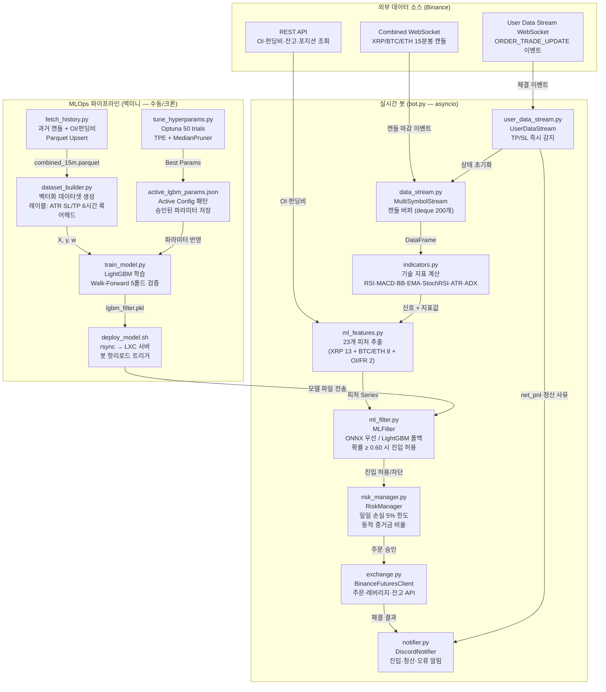
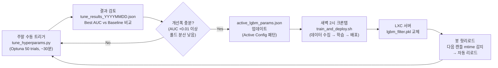
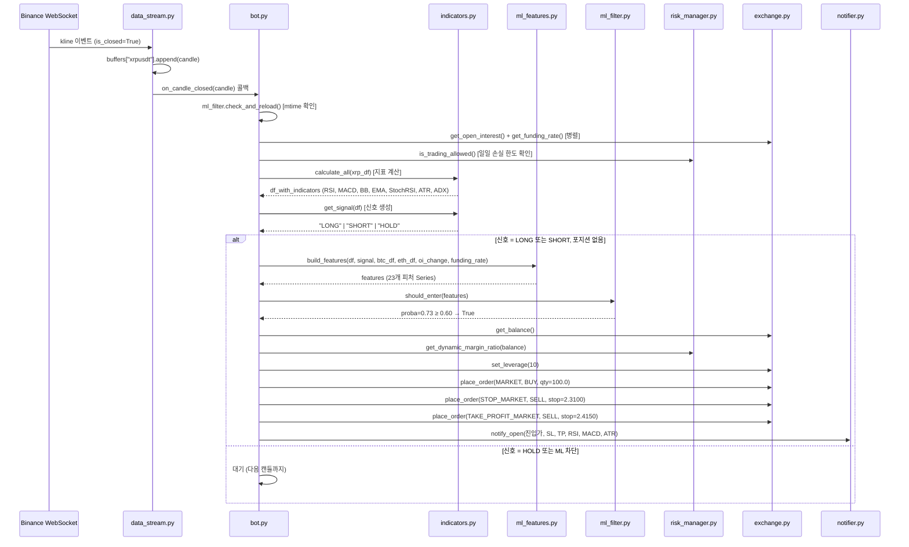
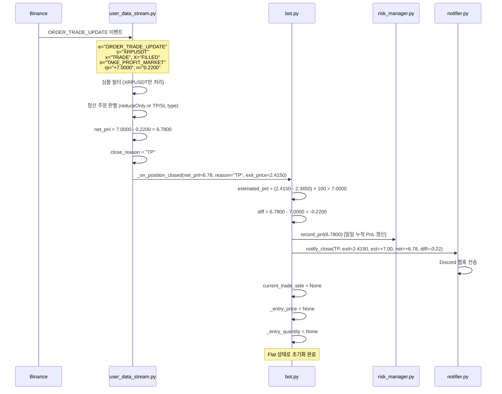

# CoinTrader — 아키텍처 문서

> 이 문서는 CoinTrader 코드베이스를 처음 접하는 개발자와 트레이딩 배경 독자 모두를 위해 작성되었습니다.  
> 기술 스택, 레이어별 역할, MLOps 파이프라인, 핵심 동작 시나리오를 순서대로 설명합니다.

---

## 목차

1. [시스템 오버뷰](#1-시스템-오버뷰)
2. [코어 레이어 아키텍처](#2-코어-레이어-아키텍처)
3. [MLOps 파이프라인 — 자가 진화 시스템](#3-mlops-파이프라인--자가-진화-시스템)
4. [핵심 동작 시나리오](#4-핵심-동작-시나리오)
5. [테스트 커버리지](#5-테스트-커버리지)

---

## 1. 시스템 오버뷰

CoinTrader는 **Binance Futures 자동매매 봇**입니다. 기술 지표 신호를 1차 필터로, LightGBM(또는 MLX 신경망) 모델을 2차 필터로 사용하여 XRPUSDT 선물 포지션을 자동 진입·청산합니다.

### 전체 데이터 파이프라인 흐름도



### 기술 스택 요약

| 분류 | 기술 |
|------|------|
| 언어 | Python 3.11+ |
| 비동기 런타임 | `asyncio` + `python-binance` WebSocket |
| 기술 지표 | `pandas-ta` (RSI, MACD, BB, EMA, StochRSI, ATR) |
| ML 프레임워크 | `LightGBM` (CPU) / `MLX` (Apple Silicon GPU) |
| 모델 서빙 | `onnxruntime` (ONNX 우선) / `joblib` (LightGBM 폴백) |
| 하이퍼파라미터 탐색 | `Optuna` (TPE Sampler + MedianPruner) |
| 데이터 저장 | `Parquet` (pyarrow) |
| 로깅 | `Loguru` |
| 알림 | Discord Webhook (`httpx`) |
| 컨테이너화 | Docker + Docker Compose |
| CI/CD | Jenkins + Gitea Container Registry |
| 운영 서버 | LXC 컨테이너 (`10.1.10.24`) |

---

## 2. 코어 레이어 아키텍처

봇은 5개의 레이어로 구성됩니다. 각 레이어는 단일 책임을 가지며, 위에서 아래로 데이터가 흐릅니다.

```
┌─────────────────────────────────────────────────────┐
│  Layer 1: Data Layer         data_stream.py          │
│           캔들 수신 · 버퍼 관리 · 과거 데이터 프리로드  │
├─────────────────────────────────────────────────────┤
│  Layer 2: Signal Layer       indicators.py           │
│           기술 지표 계산 · 복합 신호 생성              │
├─────────────────────────────────────────────────────┤
│  Layer 3: ML Filter Layer    ml_filter.py            │
│           LightGBM/ONNX 확률 예측 · 진입 차단         │
├─────────────────────────────────────────────────────┤
│  Layer 4: Execution & Risk   exchange.py             │
│           Layer              risk_manager.py         │
│           주문 실행 · 포지션 관리 · 리스크 제어         │
├─────────────────────────────────────────────────────┤
│  Layer 5: Event / Alert      user_data_stream.py     │
│           Layer              notifier.py             │
│           TP/SL 즉시 감지 · Discord 알림              │
└─────────────────────────────────────────────────────┘
```

---

### Layer 1: Data Layer

**파일:** `src/data_stream.py`

봇이 시작되면 가장 먼저 실행되는 레이어입니다. Binance Combined WebSocket 단일 연결로 XRP·BTC·ETH 3개 심볼의 15분봉 캔들을 동시에 수신합니다.

**핵심 동작:**

1. **프리로드**: 봇 시작 시 REST API로 과거 캔들 200개를 `deque`에 즉시 채웁니다. EMA50 안정화에 필요한 최소 캔들(100개)을 확보하여 첫 캔들부터 신호를 계산할 수 있게 합니다.
2. **버퍼 관리**: 심볼별 `deque(maxlen=200)`에 마감된 캔들만 추가합니다. 미마감 캔들(`is_closed=False`)은 무시합니다.
3. **콜백 트리거**: XRP(주 심볼) 캔들이 마감되면 `bot._on_candle_closed()`를 호출합니다. BTC·ETH는 버퍼에만 쌓이고 콜백을 트리거하지 않습니다.

```
Combined WebSocket
  ├── xrpusdt@kline_15m  →  buffers["xrpusdt"]  →  on_candle() 호출
  ├── btcusdt@kline_15m  →  buffers["btcusdt"]  (콜백 없음)
  └── ethusdt@kline_15m  →  buffers["ethusdt"]  (콜백 없음)
```

---

### Layer 2: Signal Layer

**파일:** `src/indicators.py`

`pandas-ta` 라이브러리로 기술 지표를 계산하고, 복합 가중치 시스템으로 매매 신호를 생성합니다.

**계산되는 지표:**

| 지표 | 파라미터 | 역할 |
|------|---------|------|
| RSI | length=14 | 과매수/과매도 판단 |
| MACD | (12, 26, 9) | 추세 전환 감지 (골든/데드크로스) |
| 볼린저 밴드 | (20, 2σ) | 가격 이탈 감지 |
| EMA | (9, 21, 50) | 추세 방향 (정배열/역배열) |
| Stochastic RSI | (14, 14, 3, 3) | 단기 과매수/과매도 |
| ATR | length=14 | 변동성 측정 → SL/TP 계산에 사용 |
| ADX | length=14 | 추세 강도 측정 → 횡보장 필터 (ADX < 25 시 진입 차단) |
| Volume MA | length=20 | 거래량 급증 감지 |

**신호 생성 로직 (ADX 필터 + 가중치 합산):**

```
[1단계] ADX 횡보장 필터:
  ADX < 25 → 즉시 HOLD 반환 (추세 부재로 진입 차단)

[2단계] 롱 신호 점수:
  RSI < 35                          → +1
  MACD 골든크로스 (전봉→현봉)          → +2  ← 강한 신호
  종가 < 볼린저 하단                  → +1
  EMA 정배열 (9 > 21 > 50)           → +1
  StochRSI K < 20 and K > D         → +1

진입 조건: 점수 ≥ 3 AND (거래량 급증 OR 점수 ≥ 4)
SL = 진입가 - ATR × 1.5
TP = 진입가 + ATR × 3.0  (리스크:리워드 = 1:2)
```

숏 신호는 롱의 대칭 조건으로 계산됩니다.

---

### Layer 3: ML Filter Layer

**파일:** `src/ml_filter.py`, `src/ml_features.py`

기술 지표 신호가 발생해도 ML 모델이 "이 타점은 실패 확률이 높다"고 판단하면 진입을 차단합니다. 오진입(억까 타점)을 줄이는 2차 게이트키퍼입니다.

**모델 우선순위:**

```
ONNX (MLX 신경망)  →  LightGBM  →  폴백(항상 허용)
```

모델 파일이 없으면 모든 신호를 허용합니다. 봇 재시작 없이 모델 파일을 교체하면 다음 캔들 마감 시 자동으로 핫리로드됩니다(`mtime` 감지).

**23개 ML 피처:**

```
XRP 기술 지표 (13개):
  rsi, macd_hist, bb_pct, ema_align, stoch_k, stoch_d,
  atr_pct, vol_ratio, ret_1, ret_3, ret_5,
  signal_strength, side

BTC/ETH 상관관계 (8개):
  btc_ret_1, btc_ret_3, btc_ret_5,
  eth_ret_1, eth_ret_3, eth_ret_5,
  xrp_btc_rs, xrp_eth_rs

시장 미시구조 (2개):
  oi_change    ← 이전 캔들 대비 미결제약정 변화율
  funding_rate ← 현재 펀딩비
```

`oi_change`와 `funding_rate`는 캔들 마감마다 Binance REST API로 실시간 조회합니다. API 실패 시 `0.0`으로 폴백하여 봇이 멈추지 않습니다.

**진입 판단:**

```python
proba = model.predict_proba(features)[0][1]  # 성공 확률
return proba >= 0.60  # 임계값 60%
```

---

### Layer 4: Execution & Risk Layer

**파일:** `src/exchange.py`, `src/risk_manager.py`

ML 필터를 통과한 신호를 실제 주문으로 변환하고, 리스크 한도를 관리합니다.

**포지션 크기 계산 (동적 증거금 비율):**

잔고가 늘어날수록 증거금 비율을 선형으로 줄여 복리 과노출을 방지합니다.

```
증거금 비율 = max(20%, min(50%, 50% - (잔고 - 기준잔고) × 0.0006))
명목금액 = 잔고 × 증거금 비율 × 레버리지
수량 = 명목금액 / 현재가
```

**주문 흐름:**

```
1. set_leverage(10x)
2. place_order(MARKET)          ← 진입
3. place_order(STOP_MARKET)     ← SL 설정
4. place_order(TAKE_PROFIT_MARKET) ← TP 설정
```

SL/TP 주문은 `/fapi/v1/algoOrder` 엔드포인트로 전송됩니다 (일반 계정의 `-4120` 오류 대응).

**리스크 제어:**

| 제어 항목 | 기준 |
|----------|------|
| 일일 최대 손실 | 기준 잔고의 5% |
| 최대 동시 포지션 | 3개 |
| 최소 명목금액 | $5 USDT |

**반대 시그널 재진입:** 보유 포지션과 반대 방향 신호 발생 시 기존 포지션을 즉시 청산하고, ML 필터 통과 시 반대 방향으로 재진입합니다. 재진입 중 User Data Stream 콜백이 신규 포지션 상태를 덮어쓰지 않도록 `_is_reentering` 플래그로 보호합니다.

---

### Layer 5: Event / Alert Layer

**파일:** `src/user_data_stream.py`, `src/notifier.py`

기존 폴링 방식(캔들 마감마다 포지션 조회)의 한계를 극복하기 위해 도입된 레이어입니다.

**User Data Stream의 역할:**

Binance `ORDER_TRADE_UPDATE` 웹소켓 이벤트를 구독하여 TP/SL 체결을 **즉시** 감지합니다. 기존 방식은 최대 15분 지연이 발생했지만, 이제 체결 즉시 콜백이 호출됩니다.

```
이벤트 필터링 조건:
  e == "ORDER_TRADE_UPDATE"
  AND s == "XRPUSDT"          ← 심볼 필터
  AND x == "TRADE"            ← 실제 체결
  AND X == "FILLED"           ← 완전 체결
  AND (reduceOnly OR order_type in {STOP_MARKET, TAKE_PROFIT_MARKET} OR rp != 0)
```

청산 사유 분류:
- `TAKE_PROFIT_MARKET` → `"TP"`
- `STOP_MARKET` → `"SL"`
- 그 외 → `"MANUAL"`

순수익 계산:
```
net_pnl = realized_pnl - commission
```

**Discord 알림 포맷:**

진입 시:
```
[XRPUSDT] LONG 진입
진입가: 2.3450 | 수량: 100.0 | 레버리지: 10x
SL: 2.3100 | TP: 2.4150
RSI: 32.50 | MACD Hist: -0.000123 | ATR: 0.023400
```

청산 시:
```
✅ [XRPUSDT] LONG TP 청산
청산가:               2.4150
예상 수익:            +7.0000 USDT
실제 순수익:          +6.7800 USDT
차이(슬리피지+수수료): -0.2200 USDT
```

---

## 3. MLOps 파이프라인 — 자가 진화 시스템

봇의 ML 모델은 고정된 것이 아니라 주기적으로 재학습·개선됩니다. 전체 라이프사이클은 다음과 같습니다.

### 3.1 전체 라이프사이클



### 3.2 단계별 상세 설명

#### Step 1: Optuna 하이퍼파라미터 탐색

`scripts/tune_hyperparams.py`는 LightGBM의 9개 하이퍼파라미터를 자동으로 탐색합니다.

- **알고리즘**: TPE Sampler (Tree-structured Parzen Estimator) — 베이지안 최적화 계열
- **조기 종료**: MedianPruner — 중간 폴드 AUC가 중앙값 미만이면 trial 조기 종료
- **평가 지표**: Walk-Forward 5폴드 평균 AUC (시계열 순서 유지, 미래 데이터 누수 방지)
- **클래스 불균형 처리**: 언더샘플링 (양성:음성 = 1:1, 시간 순서 유지)

탐색 공간:

```
n_estimators:      100 ~ 600
learning_rate:     0.01 ~ 0.20  (log scale)
max_depth:         2 ~ 7
num_leaves:        7 ~ min(31, 2^max_depth - 1)  ← 과적합 방지 제약
min_child_samples: 10 ~ 50
subsample:         0.5 ~ 1.0
colsample_bytree:  0.5 ~ 1.0
reg_alpha:         1e-4 ~ 1.0   (log scale)
reg_lambda:        1e-4 ~ 1.0   (log scale)
```

결과는 `models/tune_results_YYYYMMDD_HHMMSS.json`에 저장됩니다.

#### Step 2: Active Config 패턴으로 파라미터 승인

Optuna가 찾은 파라미터는 **자동으로 적용되지 않습니다.** 사람이 결과를 검토하고 직접 `models/active_lgbm_params.json`을 업데이트해야 합니다.

```json
{
  "promoted_at": "2026-03-02T14:47:49",
  "best_trial": {
    "number": 23,
    "value": 0.6821,
    "params": {
      "n_estimators": 434,
      "learning_rate": 0.123659,
      ...
    }
  }
}
```

`train_model.py`는 학습 시작 시 이 파일을 읽어 파라미터를 적용합니다. 파일이 없으면 코드 내 기본값을 사용합니다.

> **주의**: Optuna 결과는 과적합 위험이 있습니다. 폴드별 AUC 분산이 크거나 (std > 0.05), 개선폭이 미미하면 (< 0.01) 적용하지 않는 것을 권장합니다.

#### Step 3: 자동 학습 및 배포 (크론탭)

`scripts/train_and_deploy.sh`는 3단계를 자동으로 실행합니다:

```
[1/3] 데이터 수집 (fetch_history.py)
  - 기존 parquet 없음 → 1년치(365일) 전체 수집
  - 기존 parquet 있음 → 35일치 Upsert (OI/펀딩비 0.0 구간 보충)

[2/3] 모델 학습 (train_model.py)
  - active_lgbm_params.json 파라미터 로드
  - 벡터화 데이터셋 생성 (dataset_builder.py)
  - Walk-Forward 5폴드 검증 후 최종 모델 저장
  - 학습 로그: models/training_log.json

[3/3] LXC 배포 (deploy_model.sh)
  - rsync로 lgbm_filter.pkl → LXC 서버 전송
  - 기존 모델 자동 백업 (lgbm_filter_prev.pkl)
  - ONNX 파일 충돌 방지 (우선순위 보장)
```

#### Step 4: 봇 핫리로드

모델 파일이 교체되면 봇 재시작 없이 자동으로 새 모델이 적용됩니다.

```python
# bot.py → process_candle() 첫 줄
self.ml_filter.check_and_reload()

# ml_filter.py → check_and_reload()
onnx_changed = _mtime(self._onnx_path) != self._loaded_onnx_mtime
lgbm_changed = _mtime(self._lgbm_path) != self._loaded_lgbm_mtime
if onnx_changed or lgbm_changed:
    self._try_load()  # 새 모델 로드
```

매 캔들 마감(15분)마다 모델 파일의 `mtime`을 확인합니다. 변경이 감지되면 즉시 리로드합니다.

### 3.3 레이블 생성 방식

학습 데이터의 레이블은 **미래 6시간(24캔들) 룩어헤드**로 생성됩니다.

```
신호 발생 시점 기준:
  SL = 진입가 - ATR × 1.5
  TP = 진입가 + ATR × 3.0

향후 24캔들 동안:
  - 저가가 SL에 먼저 닿으면 → label = 0 (실패)
  - 고가가 TP에 먼저 닿으면 → label = 1 (성공)
  - 둘 다 안 닿으면 → 샘플 제외
```

보수적 접근: SL 체크를 TP보다 먼저 수행하여 동시 돌파 시 실패로 처리합니다.

---

## 4. 핵심 동작 시나리오

### 시나리오 1: 15분 캔들 마감 시 봇의 동작 흐름

> "XRP 15분봉이 마감되면 봇은 무엇을 하는가?"



**핵심 포인트:**
- OI·펀딩비 조회는 `asyncio.gather()`로 병렬 실행 → 지연 최소화
- ML 필터가 없으면(모델 파일 없음) 모든 신호를 허용
- 명목금액 < $5 USDT이면 주문을 건너뜀 (바이낸스 최소 주문 제약)

---

### 시나리오 2: TP/SL 체결 시 봇의 동작 흐름

> "거래소에서 TP가 작동하면 봇은 어떻게 반응하는가?"



**핵심 포인트:**
- User Data Stream은 `asyncio.gather()`로 캔들 스트림과 **병렬** 실행
- 체결 즉시 감지 (최대 15분 지연이었던 폴링 방식 대비 실시간)
- `realized_pnl - commission` = 정확한 순수익 (슬리피지·수수료 포함)
- `_is_reentering` 플래그: 반대 시그널 재진입 중에는 콜백이 신규 포지션 상태를 초기화하지 않음

---

## 5. 테스트 커버리지

### 5.1 테스트 파일 구성

`tests/` 폴더에 13개 테스트 파일, 총 **83개의 테스트 케이스**가 작성되어 있습니다.

```bash
pytest tests/ -v          # 전체 실행
bash scripts/run_tests.sh  # 래퍼 스크립트 실행
```

### 5.2 모듈별 테스트 현황

| 테스트 파일 | 대상 모듈 | 테스트 케이스 | 주요 검증 항목 |
|------------|----------|:------------:|--------------|
| `test_bot.py` | `src/bot.py` | 11 | 반대 시그널 재진입 흐름, ML 차단 시 재진입 스킵, OI/펀딩비 피처 전달, OI 변화율 계산 |
| `test_indicators.py` | `src/indicators.py` | 7 | RSI 범위(0~100), MACD 컬럼 존재, 볼린저 밴드 상하단 대소관계, 신호 반환값 유효성, ADX 컬럼 존재, ADX<25 횡보장 차단, ADX NaN 폴스루 |
| `test_ml_features.py` | `src/ml_features.py` | 11 | 23개 피처 수, BTC/ETH 포함 시 피처 수, RS 분모 0 처리, NaN 없음, side 인코딩, OI/펀딩비 파라미터 반영 |
| `test_ml_filter.py` | `src/ml_filter.py` | 5 | 모델 없을 때 폴백 허용, 임계값 이상/미만 판단, 핫리로드 후 상태 변화 |
| `test_risk_manager.py` | `src/risk_manager.py` | 8 | 일일 손실 한도 초과 차단, 최대 포지션 수 제한, 동적 증거금 비율 상한/하한 클램핑 |
| `test_exchange.py` | `src/exchange.py` | 8 | 수량 계산(기본/최소명목금액/잔고0), OI·펀딩비 조회 정상/오류 시 반환값 |
| `test_data_stream.py` | `src/data_stream.py` | 6 | 3심볼 버퍼 존재, 빈 버퍼 None 반환, 캔들 파싱, 마감 캔들 콜백 호출, 프리로드 200개 |
| `test_label_builder.py` | `src/label_builder.py` | 4 | LONG TP 도달 → 1, LONG SL 도달 → 0, 미결 → None, SHORT TP 도달 → 1 |
| `test_dataset_builder.py` | `src/dataset_builder.py` | 9 | DataFrame 반환, 필수 컬럼 존재, 레이블 이진값, BTC/ETH 포함 시 23개 피처, inf/NaN 없음, OI nan 마스킹, RS 분모 0 처리 |
| `test_mlx_filter.py` | `src/mlx_filter.py` | 5 | GPU 디바이스 확인, 학습 전 예측 형태, 학습 후 유효 확률, NaN 피처 처리, 저장/로드 후 동일 예측 |
| `test_fetch_history.py` | `scripts/fetch_history.py` | 5 | OI=0 구간 Upsert, 신규 행 추가, 기존 비0값 보존, 파일 없을 때 신규 반환, 타임스탬프 오름차순 정렬 |
| `test_config.py` | `src/config.py` | 2 | 환경변수 로드, 동적 증거금 파라미터 로드 |
| `test_database.py` | `src/database.py` | 2 | 거래 저장, 거래 청산 업데이트 (Notion API Mock) |

> `test_mlx_filter.py`는 Apple Silicon(`mlx` 패키지)이 없는 환경에서 자동 스킵됩니다.  
> `test_database.py`는 현재 미사용 모듈(`src/database.py`)을 대상으로 하며, 실제 운영 경로와 무관합니다.

### 5.3 커버리지 매트릭스

아래는 핵심 비즈니스 로직의 테스트 커버 여부입니다.

| 기능 | 단위 테스트 | 통합 수준 테스트 | 비고 |
|------|:----------:|:--------------:|------|
| 기술 지표 계산 (RSI/MACD/BB/EMA/StochRSI) | ✅ | ✅ | `test_indicators` + `test_ml_features` |
| 신호 생성 (가중치 합산) | ✅ | ✅ | `test_indicators` + `test_dataset_builder` |
| ADX 횡보장 필터 (ADX < 25 차단) | ✅ | — | `test_indicators` (ADX 컬럼·차단·NaN 3개) |
| ML 피처 추출 (23개) | ✅ | — | `test_ml_features` |
| ML 필터 추론 (임계값 판단) | ✅ | — | `test_ml_filter` |
| MLX 신경망 학습/저장/로드 | ✅ | — | `test_mlx_filter` (Apple Silicon 전용) |
| 레이블 생성 (SL/TP 룩어헤드) | ✅ | — | `test_label_builder` |
| 벡터화 데이터셋 빌더 | ✅ | ✅ | `test_dataset_builder` |
| 동적 증거금 비율 계산 | ✅ | — | `test_risk_manager` |
| 일일 손실 한도 제어 | ✅ | — | `test_risk_manager` |
| 포지션 수량 계산 | ✅ | — | `test_exchange` |
| OI/펀딩비 API 조회 (정상/오류) | ✅ | — | `test_exchange` |
| 반대 시그널 재진입 흐름 | ✅ | ✅ | `test_bot` |
| ML 차단 시 재진입 스킵 | ✅ | — | `test_bot` |
| OI 변화율 계산 (API 실패 폴백) | ✅ | — | `test_bot` |
| 캔들 버퍼 관리 및 프리로드 | ✅ | — | `test_data_stream` |
| Parquet Upsert (OI=0 보충) | ✅ | — | `test_fetch_history` |
| User Data Stream TP/SL 감지 | ❌ | — | 미작성 (실제 WebSocket 의존) |
| Discord 알림 전송 | ❌ | — | 미작성 (외부 웹훅 의존) |
| CI/CD 파이프라인 | ❌ | — | Jenkins 환경 의존 |

### 5.4 테스트 전략

**Mock 활용 원칙:**
- Binance API 호출(`BinanceFuturesClient`, `AsyncClient`)은 모두 `unittest.mock.AsyncMock`으로 대체합니다.
- 외부 의존성(Discord Webhook, Binance WebSocket)은 테스트 대상에서 제외합니다.
- `tmp_path` pytest fixture로 Parquet 파일 I/O를 격리합니다.

**비동기 테스트:**
- `pytest-asyncio`를 사용하며, `@pytest.mark.asyncio` 데코레이터로 `async def` 테스트를 실행합니다.

**경계값 및 엣지 케이스 중심:**
- 분모 0 (RS 계산, bb_range, vol_ma20)
- API 실패 시 `None` 반환 및 `0.0` 폴백
- 최소 명목금액 미달 시 주문 스킵
- OI=0 구간 Parquet Upsert 보존/덮어쓰기 조건

---

## 부록: 파일별 역할 요약

| 파일 | 레이어 | 역할 |
|------|--------|------|
| `main.py` | — | 진입점. `Config` 로드 후 `TradingBot.run()` 실행 |
| `src/bot.py` | 오케스트레이터 | 모든 레이어를 조율하는 메인 트레이딩 루프 |
| `src/config.py` | — | 환경변수 기반 설정 (`@dataclass`) |
| `src/data_stream.py` | Data | Combined WebSocket 캔들 수신·버퍼 관리 |
| `src/indicators.py` | Signal | 기술 지표 계산 및 복합 신호 생성 |
| `src/ml_features.py` | ML Filter | 23개 ML 피처 추출 |
| `src/ml_filter.py` | ML Filter | ONNX/LightGBM 모델 로드·추론·핫리로드 |
| `src/mlx_filter.py` | ML Filter | Apple Silicon GPU 학습 + ONNX export |
| `src/exchange.py` | Execution | Binance Futures REST API 클라이언트 |
| `src/risk_manager.py` | Risk | 일일 손실 한도·동적 증거금 비율·포지션 수 제어 |
| `src/user_data_stream.py` | Event | User Data Stream TP/SL 즉시 감지 |
| `src/notifier.py` | Alert | Discord 웹훅 알림 |
| `src/label_builder.py` | MLOps | 학습 레이블 생성 (ATR SL/TP 룩어헤드) |
| `src/dataset_builder.py` | MLOps | 벡터화 데이터셋 빌더 (학습용) |
| `src/logger_setup.py` | — | Loguru 로거 설정 |
| `scripts/fetch_history.py` | MLOps | 과거 캔들 + OI/펀딩비 수집 (Parquet Upsert) |
| `scripts/train_model.py` | MLOps | LightGBM 모델 학습 (CPU) |
| `scripts/train_mlx_model.py` | MLOps | MLX 신경망 학습 (Apple Silicon GPU) |
| `scripts/tune_hyperparams.py` | MLOps | Optuna 하이퍼파라미터 탐색 (수동 트리거) |
| `scripts/train_and_deploy.sh` | MLOps | 전체 파이프라인 (수집→학습→배포) |
| `scripts/deploy_model.sh` | MLOps | 모델 파일 LXC 서버 전송 |
| `models/active_lgbm_params.json` | MLOps | 승인된 LightGBM 파라미터 (Active Config) |
